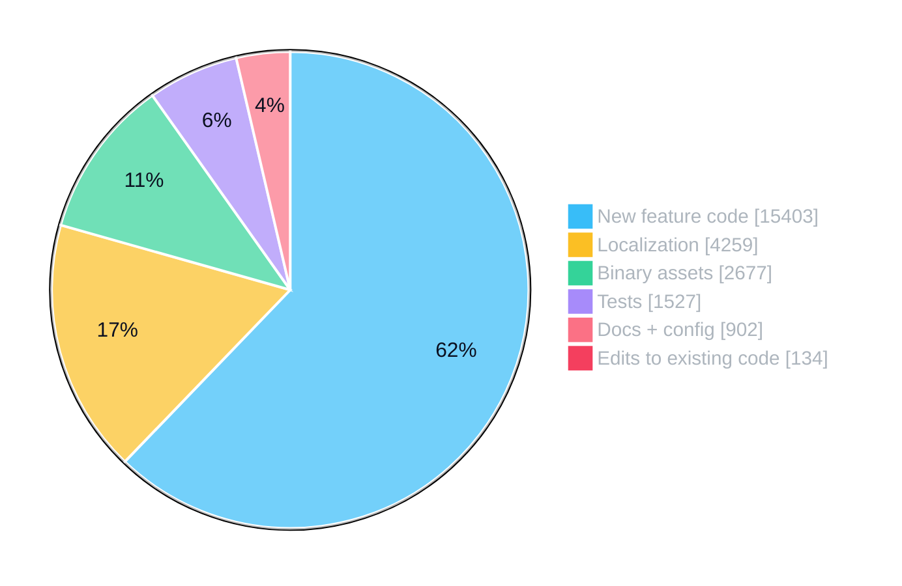
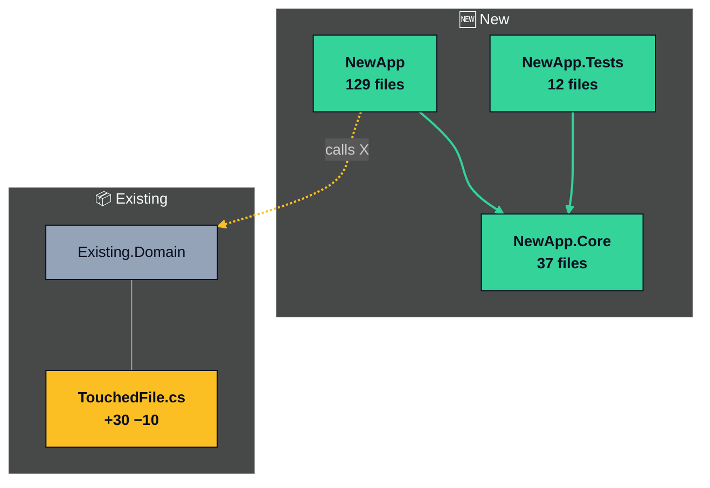

# Reality Check — The PR Size & Risk Detector 💅📏

Okay so here's the thing nobody wants to say out loud: the numbers GitHub slaps on a PR are basically **propaganda**. `347 files changed, +18,402 −12,981, 62 commits` — that badge has scared off more reviewers than an actual production outage. And the WORST part? Those numbers reward sloppy code and punish clean code.

- Wrap an existing block in an `if` and every line inside counts as a delete AND an add. You changed two lines; the diff says forty.
- DRY it up with an interface and a couple of implementations? Congrats, you made more files than the person who copy-pasted the same logic five times. The badge thinks YOU'RE the messy one. Um, excuse me?
- Actually *document* your code with doc comments (especially XML `///` comments — a single method can sprout `<summary>`, `<param>`, `<returns>`, `<exception>` lines) and your line count balloons. Good comments make the badge go absolutely feral. Responsible engineers get punished for being thorough.
- The localizers drop ten `.resx` files for one new string and suddenly your "small" PR looks like a rewrite.
- A brand-new feature in its own isolated folder — touching literally nothing that already exists — looks "bigger" than a twelve-line change that quietly rewires authentication for the whole app. Any engineer worth their salt knows which one is actually scary, and it's NOT the big one.

Your job in this skill is to be the adult in the room. Examine the PR, strip out the noise, and tell everyone what's **actually** going on: how big it really is, what it really touches, and what a reviewer should actually look at. Receipts only. No vibes.

> **⚖️ Objective, not flattering.** This skill exists to fight *misleading* numbers, not to cheerlead. It will get run on strangers' PRs, on PRs you'll merge into prod, on PRs you're skeptical of — so the analysis has to be honest enough to *trust*. Report measurable facts and flag real concerns even when they're inconvenient. Never inflate the good (no "Thoroughly tested!" sticker just because test files exist, no "just 18 deletions" spin) and never bury the bad. SnarkGirl's voice stays sassy; her *findings* stay defensible. If you wouldn't bet money on a claim, don't make it — say what you can actually observe and tell the reviewer what to verify themselves.

## When This Skill Activates

- User asks how big a PR "really" is, or says the stats look scary
- User wants a PR sized up / triaged before reviewing or before asking others to review
- User feels the raw numbers are misrepresenting their work (too big OR too small)
- User wants a reviewer's guide — "where do I even start with this?"
- User is about to open a PR and wants an honest size/risk label for the description

This is a **read-only analysis** skill. You're measuring and explaining, not reviewing line-by-line (that's `snark-pr-review`) and not changing code.

## Step 1: Grab the PR and the Scary Numbers

Figure out what you're measuring — an open PR, a branch vs a base, or staged/working changes.

**For a GitHub PR:**
```bash
# The scary badge numbers, straight from the source
gh pr view {N} --json additions,deletions,changedFiles,commits,title,baseRefName,headRefName

# Per-file stat overview
gh pr diff {N} --patch | head -200      # peek at the actual content
```

**For a branch or local work:**
```bash
git rev-parse --verify main 2>/dev/null && BASE=main || BASE=master
git diff $BASE...HEAD --numstat        # per-file additions/deletions (raw)
git log $BASE..HEAD --oneline          # commit count + story
```

Write down the **raw stats** exactly as GitHub shows them. You're going to quote them back, then dismantle them. That contrast is the whole point.

## Step 2: Classify Every File — This Is the Whole Skill

Go through the changed files and sort each one into a bucket. The buckets are what turn a meaningless line count into actual signal.

| Bucket | What goes here | Review weight |
|--------|----------------|---------------|
| 🤖 **Generated / Noise** | Lockfiles (`package-lock.json`, `yarn.lock`, `go.sum`, `Cargo.lock`), build output, `*.designer.cs`, generated clients, snapshots, minified bundles, anything marked `linguist-generated` | **Zero.** Don't read it. |
| 🖼️ **Binary / Assets** | Fonts (`.ttf`, `.woff`), images (`.png`, `.svg`, `.jpg`), audio (`.wav`), icons, `.plist`, `.appxmanifest`, design assets | **Zero.** Enormous line/byte counts, no logic to review. |
| 🌍 **Localization** | `.resx`, `.po`, `.xliff`, i18n `*.json` translation bundles | **Near-zero.** Mechanical, low-risk bulk. |
| 🚚 **Moves / Renames** | Files relocated or renamed with little content change | **Low.** Same code, new address. |
| 🎨 **Formatting / Whitespace** | Reindentation, prettier/gofmt runs, line wrapping, wrapping a block in `if`/`try` | **Low.** Looks huge, means almost nothing. |
| 💬 **Comments / Docs** | New doc comments (XML `///`, JSDoc, docstrings), inline comments, README/markdown | **Low.** A green flag, not bloat. Strip from the size math. |
| 🧱 **Good-Practice Boilerplate** | New interfaces, DI registrations, barrel/index exports, type definitions, DTOs added for DRY/reuse/extensibility | **Low.** Lots of lines, tiny cognitive load. |
| 🆕 **Net-New Additive** | Brand-new files/features in isolated areas — especially a whole new project/module nothing else imports yet | **Medium.** Worth reading, but it literally can't break what already ships. |
| ✏️ **Behavioral Change to Existing Code** | Edits to existing functions, control flow, conditions, existing public APIs | **HIGH. This is the PR.** |
| ✅ **Tests** | Test files, fixtures, mocks | **Context.** Additions are a green flag; track separately. |

### First pass: the added / modified / deleted ratio (your fastest, loudest tell)

Before any per-file work, get the status breakdown — it tells you in one shot whether this is a "new stuff" PR or a "rewiring existing stuff" PR:

```bash
# PR: per-file status + adds/deletes in a single call
gh api repos/{owner}/{repo}/pulls/{N}/files --paginate \
  -q '.[] | "\(.status) \(.additions) \(.deletions) \(.filename)"'

# Branch/local equivalent
git diff $BASE...HEAD --name-status     # A = added, M = modified, D = deleted
```

Then read the two numbers that matter most:

- **Total deletions across the whole PR.** This is the single best risk signal there is. If a 217-file, +25k PR has **−18 total deletions**, it is ~99.9% additive — it can barely *reach* existing behavior, let alone break it. Lead your whole verdict with this. A near-zero deletion count is the most reassuring number in the entire diff, and nobody ever looks at it.
- **Added-file count vs modified-file count.** "202 added, 15 modified" instantly reframes a scary badge as "a big pile of new files plus a handful of touched ones." The new files are 🆕; only the modified ones can carry real risk.

**"Modified" status does NOT mean "behavioral change."** A file shows as `modified` the moment one line is appended. Check each modified file's deletion count: a modified file with **~0 deletions** is just additive (new methods/properties bolted on, existing code untouched) — bucket it 🆕, not ✏️. Only modified files with **real deletions** are candidates for the scary ✏️ bucket, and even then — read the next trap before you trust the number.

### The whitespace trick (do this — it's the user's pet peeve)

To find changes that *look* big but are actually just reindentation (e.g., someone wrapped existing code in an `if` or `try`), diff with whitespace ignored and compare:

```bash
# Raw line counts
git diff $BASE...HEAD --numstat

# Same diff, ignoring whitespace/indentation changes
git diff -w $BASE...HEAD --numstat
```

If a file shows big numbers in the first command but ~0/0 in the `-w` version, those changes are **indentation only** — bucket it as 🎨 Formatting and basically forgive it. That `40 −38` file? It's a two-line change wearing a fog machine.

### The inserted-method realignment trap (the sneaky one)

A `modified` file can show fat deletion counts that are **pure illusion**. When someone inserts a new method/function *between* two existing ones, the line diff often misaligns and reports the trailing existing lines as deleted-then-re-added — so a file that only ADDED two new methods can read as `+30 −10`. Those 10 "deletions" are existing code that reappears nearly identically a few lines down.

Before you label a modified file as 🔴 behavioral risk, **actually read the hunks** and check whether the deleted lines re-appear unchanged right after an inserted block:

```bash
# Histogram/patience algorithms realign inserted blocks better and
# collapse the fake deletions — compare the deletion count to the default diff
git diff --diff-algorithm=histogram $BASE...HEAD -- path/to/File.cs
```

The *genuine* behavioral change is only the lines that truly differ (a changed `catch`, a swapped endpoint, a new condition) — often a tiny fraction of the reported deletions. Quote the real delta, not git's inflated one.

### Spot comment/doc inflation

Doc comments are pure green-flag content that the badge counts as "code." When a file's added lines are heavy on comments, call it out so it doesn't inflate the real size:

```bash
# Roughly how many ADDED lines in this file are comments/docs?
# (XML doc comments, // and /* */, # docstrings, JSDoc)
git diff $BASE...HEAD -- path/to/File.cs | grep -E '^\+\s*(///|//|/\*|\*|#)' | wc -l
```

If a big chunk of a file's additions are `///` summaries and param docs, subtract that from the "meaningful change" — documenting your code is the OPPOSITE of risk. Reward it, don't count it against them.

### Detect moves, renames, and added-vs-modified

```bash
# Renames/copies with similarity %
git diff -M --summary $BASE...HEAD

# Added files (net-new) vs modified files (the risky ones)
git diff --diff-filter=A --name-only $BASE...HEAD   # added
git diff --diff-filter=M --name-only $BASE...HEAD   # modified
git diff --diff-filter=D --name-only $BASE...HEAD   # deleted (deletions of live logic = pay attention)

# Generated files declared by the repo
grep -i "linguist-generated" .gitattributes 2>/dev/null
```

## Step 3: The Risk Lens — What Actually Matters

Size and risk are different animals. A massive additive PR can be low-risk; a tiny edit can be terrifying. Assess risk with real questions:

- **Does it change existing behavior, or only add?** Purely additive code can't break what already ships. Edits to existing logic can.
- **Blast radius.** Are the modified files widely imported? Check it — don't guess:
  ```bash
  # How many places import the thing being changed?
  grep -rl "ModuleName" --include="*.ts" . | wc -l
  ```
  A change to a leaf component touches one screen. A change to a shared util touches everything.
- **Public API / signature changes.** Changing a function signature, exported type, or endpoint contract has reach far beyond the diff.
- **Deletions of live code.** Removing existing logic is riskier than adding new logic. `--diff-filter=D` and removed lines in modified files deserve eyes.
- **Core vs leaf.** A change in `auth/`, `payments/`, `core/`, or a base class is fundamentally scarier than the same line count in a brand-new isolated feature folder.
- **Cohesion.** Is this one logical change, or twelve unrelated ones smuggled into one PR? Many distinct changes = harder to review safely, regardless of size.

## Step 4: Compute the Real Size & Real Risk

**Real (effective) change** = total adds/dels **minus** Generated, Localization, Moves, Formatting, and Comments/Docs buckets. Weight 🆕 Net-New lighter than ✏️ Behavioral edits, because changing existing code is where bugs hide.

**Real Size** (based on effective behavioral lines, not the raw badge):

| Label | Roughly | Vibe |
|-------|---------|------|
| 🟢 **XS** | < 20 meaningful lines | "Bestie this is a one-coffee review." |
| 🟢 **S** | 20–75 | "Quick and clean." |
| 🟡 **M** | 75–250 | "Sit down for this one but it's fine." |
| 🟠 **L** | 250–600 | "Block out real time." |
| 🔴 **XL** | 600+ | "Okay this one earned its badge." |

**Real Risk:**

| Label | When |
|-------|------|
| 🟢 **Low** | Purely additive, isolated new area, no existing behavior changed, narrow blast radius |
| 🟡 **Medium** | Some existing files modified, moderate blast radius, signatures stable |
| 🔴 **High** | Changes existing behavior in core/shared modules, public API/signature changes, deletions of live logic, or wide blast radius |

A PR can be 🔴 XL size and 🟢 Low risk (big new isolated feature). It can be 🟢 XS size and 🔴 High risk (tiny edit to auth). **Say so loudly** — that decoupling is the entire reason this skill exists.

**Humidity — a real DRYness measure, not a vibe:**

The file count is innocent until proven guilty. A high file count is usually *good* engineering (interfaces, one concern per file), not bloat. So instead of eyeballing it, **measure duplication** and report it as **Humidity %** — the pun is the point: low humidity = dry = DRY code; high humidity = wet = copy-paste soup.

**How to compute it (duplicate-block detection):** flag blocks of **≥6 consecutive matching lines**, after normalizing away noise (trim whitespace, ignore brace-only lines, ignore comments, case-insensitive). Humidity is just the share of code that lives in those repeated blocks:

```
Humidity % = (significant LOC inside duplicated ≥6-line blocks) / (total significant LOC) × 100
```

Compute it with the skill's bundled `humidity.py` — it normalizes each line, hashes every 6-significant-line window, and marks the lines of any window whose hash repeats as "wet". Run it over just the PR's NEW production files:

```bash
python humidity.py <repo_root> <list_of_added_source_files.txt>
```

(If your environment already has a dedicated duplicate-detection CLI, you can use that instead — the metric is the same: share of lines inside repeated ≥6-line blocks.)

Analyze the **new production code** (exclude tests, generated/Designer files, and assets). Report the number plus where the wetness is — duplication in platform glue or page code-behind is expected and forgivable; duplication in core business logic is the real smell.

| Humidity | Label | What it tells the reviewer |
|----------|-------|----------------------------|
| **< 5%** | 🟢 Very dry | Strongly DRY. The file count is architecture, not sprawl. Don't penalize it. |
| **5–15%** | 🟢 Dry | Healthy. Minor repetition, mostly in boilerplate-y spots. |
| **15–30%** | 🟡 Humid | Some real copy-paste worth factoring; point at the wettest files. |
| **> 30%** | 🔴 Swamp | Significant duplication. *This* is the bloat the badge should've caught (and ironically it often looks "smaller" than the DRY version). |

Always name the actual numbers (e.g. "Humidity 1.8% — 135 of 7,554 significant LOC in repeated blocks, mostly platform-camera glue"). The point: **good code is often the one with MORE files.** A low humidity number proves the file count is the cost of DRY, reuse, and extensibility — not mess. Show the receipt so reviewers read the file count as a green flag, not a red one.

**Test signals** — report what exists, measured against the repo's *own* conventions:

The *presence* of test files is a fact. The *quality* of that testing is not something you can prove from a diff — a file named `FooTests.cs` could be one empty stub or 40 real assertions. So **report objective signals and let the reviewer judge.** Do not slap a "Thoroughly tested" sticker on a PR just because test files exist — that's exactly the feel-good inflation this skill is supposed to kill.

**Judge coverage against the project's protocol, not an absolute ideal.** Before calling anything an "untested gap," check how this codebase actually tests. Many projects deliberately unit-test only logic/business code and never test UI components, view layers, or platform glue. If a PR follows that established pattern, it is **following protocol, not leaving a gap** — say so, and do not knock it. Only flag missing tests when the PR deviates from the repo's own norm (e.g. new business logic that the project would normally test but this PR skipped).

```bash
# What test files ship with the change (a fact, not a verdict)
git diff --diff-filter=A --name-only $BASE...HEAD | grep -iE '(/|\.)test|spec'
# Look for assertions, not just file count:
git diff $BASE...HEAD -- '*[Tt]est*' | grep -ciE 'assert|expect|should|\.Is|Throws'
# Compare to how the rest of the repo is tested (do they test components, or logic only?)
ls **/[Tt]est*/ 2>/dev/null   # what does the existing test layout cover?
# CI status — report the trail, don't assume it passed
gh pr view $PR --repo $REPO --json statusCheckRollup
```

**For prior review, don't credit AI passes — credit resolved human feedback.** A Copilot/Claude/SnarkGirl pass is not verification; a *human reviewer whose comments were addressed* is. Pull the review threads and report how many were resolved, and for any still-open ones, whether the author replied with an explanation (an answered-but-open thread is very different from an ignored one):

```bash
gh api graphql -f query='
  query($owner:String!,$repo:String!,$num:Int!){
    repository(owner:$owner,name:$repo){ pullRequest(number:$num){
      reviewThreads(first:100){ totalCount nodes{
        isResolved
        comments(first:20){ nodes{ author{login} } }
      }}}}}' -F owner=$OWNER -F repo=$REPO -F num=$PR
```

Read it as: thread `isResolved:true` = handled; `isResolved:false` with only the reviewer's own comment = **open and unanswered** (call it out); `isResolved:false` but with a reply from the author = open but explained. Report e.g. "Human review: 6 threads, 5 resolved, 1 open with an author reply" or "No human review comments yet." If there are zero threads, just say so — don't invent a verification signal, and **don't ding the owner for a lack of reviews they don't control.**

**Always check CI, and weigh it honestly.** CI passing/failing is the most objective signal on the whole PR, so look at it:

```bash
gh pr view $PR --repo $REPO --json statusCheckRollup \
  -q '.statusCheckRollup | group_by(.conclusion // .state)
       | map({result:(.[0].conclusion // .[0].state), count:length})'
```

- **If checks exist:** report the count and result (e.g. "CI: 24/24 checks passing"). A **failing or pending** check is a genuine flag — surface it loudly, it outranks any vibe.
- **If there are no CI checks at all:** state that plainly ("no CI configured on this repo") and **do not treat it as a negative.** The owner usually can't add a pipeline in their feature PR; don't penalize them for infrastructure that isn't there.

Report it all as **measurable facts**, e.g.:
- "10 test classes, ~1,670 lines, one per logic module — matches the repo's logic-only test convention" (good signal, framed fairly)
- "New business logic in `BillingCalc` has no test, and the repo normally tests this layer" (a *real* gap — deviates from protocol)
- "No test files in this PR" (state it plainly when it matters)
- "CI: 24/24 checks passing · human review: 4 threads, 3 resolved, 1 open & unanswered" (the real status, not 'looks great!')
- "CI: 1 check failing (`unit-tests`) — must be green before merge" (a real flag, surfaced)

Use a 🟢/🟡/🔴 only for what you can actually observe, and label it honestly relative to the project's norm — `🟢 Logic covered, matches repo convention` beats a fake `🟢 Thoroughly tested`, and `🟡 Skips a module the repo usually tests` beats hand-waving. When you genuinely can't tell, say "can't assess test quality from the diff — reviewer should spot-check `X`."

## Step 5: Map the New Code (so a big 🆕 bucket isn't a black box)

When the PR is mostly net-new (big 🆕 bucket), a reviewer's real question is *"what IS all this and how is it organized?"* Don't make them spelunk. Group the new files by top-level area and explain the split — turn a scary pile into a readable map.

```bash
# Group new source files by their module/project folder
git diff --diff-filter=A --name-only $BASE...HEAD | grep '\.cs$' \
  | awk -F/ '{print $1"/"$2"/"$3}' | sort | uniq -c | sort -rn
```

Then present it as a short table or tree: each module, its file count, its job, and **why it's its own thing**. Call out the architecture story — layering (engine vs UI vs tests), separation of concerns (one folder per responsibility), and extensibility patterns (e.g. one file per input modality / strategy so adding a new one touches nothing existing). Example shape:

```
**New code, mapped** (the +{X}k isn't a blob — it's {N} clean layers):

| Module | Files | What it does | Why it's split out |
|--------|-------|--------------|--------------------|
| `Foo.Core/` | 30 | Platform-agnostic engine — {concerns}, one folder each | UI-free + unit-tested in isolation |
| `Foo.App/` | 80 | Thin UI shell consuming Core (pages, controls, platforms) | Keeps platform/UI out of the engine |
| `Test.Foo.Core/` | 9 | Tests mirroring Core 1:1 | Coverage tracks the engine structure |
```

This is what turns "217 files 😱" into "oh, it's a clean engine + app + tests, that makes sense."

## Step 6: Deliver the Reality Check

Structure it like this:

```
## 💅 SnarkGirl's Reality Check — PR #{N}: {title}

**Raw stats:**
{X} files changed · +{adds} −{dels} · {N} commits

**What that actually means:** {A} files added, {M} modified, {dels} deletions. {One sentence of plain translation that FOLLOWS THE NUMBERS — it might be reassuring ("mostly net-new, barely touches shipping code") OR a warning ("looks small but {M} of those edits are in core modules"). Do not default to reassurance.}

**What's ACTUALLY going on:**

| Bucket | Files | ~Lines | Reviewer weight |
|--------|-------|--------|-----------------|
| 🤖 Generated / Noise        | 8  | ~9,400 | skip it |
| 🖼️ Binary / assets          | 25 | ~2,700 | skip it |
| 🌍 Localization             | 11 | ~600   | skim |
| 🎨 Formatting / whitespace  | 5  | ~1,200 | forgive it |
| 💬 Comments / docs          | 6  | ~450   | green flag |
| 🧱 Good-practice boilerplate | 6  | ~300   | low |
| 🆕 Net-new additive         | 14 | ~3,100 | read |
| ✏️ Behavioral (existing code)| 3  | ~120   | 👈 READ THIS |
| ✅ Tests                    | 7  | ~900   | green flag |

**Real Size:** 🟡 M — the *meaningful* change is ~120 lines of behavioral edits plus a contained new feature. The other ~18k lines are lockfiles, translations, formatting, and (good for them) actual documentation.

**Real Risk:** 🔴 High in ONE spot — `auth/session.ts` changes existing token logic and 23 files import it. Everything else is additive and safe.

**Tested:** 🟢 Logic covered, matches repo convention — 9 test classes (~900 lines) cover every logic module; UI components aren't unit-tested, which is how this repo tests by design (not a gap). CI: passing. Human review: 4 threads, 3 resolved, 1 open with an author reply. (Can't grade test *quality* from the diff — spot-check the assertions.)

**Humidity:** 🟢 4.2% (very dry) — a duplicate-block scan found only ~120 of ~2,900 significant new LOC in repeated ≥6-line blocks, mostly platform glue. ~15 interfaces, concern-per-folder, tests mirror source. The file count is architecture, not sprawl.

**New code, mapped**
*The big 🆕 bucket isn't a blob — it's clean layers:*

| Module | Files | What it does | Why it's split out |
|--------|-------|--------------|--------------------|
| `Foo.Core/` | 30 | Platform-agnostic engine, one folder per concern | UI-free + unit-tested in isolation |
| `Foo.App/` | 80 | Thin UI shell consuming Core | Keeps platform/UI out of the engine |
| `Test.Foo.Core/` | 9 | Tests mirroring Core 1:1 | Coverage tracks engine structure |

**Reviewer's guide**
*Where to actually spend your eyeballs:*

| Priority | Where | What to check |
|----------|-------|---------------|
| 🔴 Read closely | `auth/session.ts:88–140` | The real change. Existing behavior, wide blast radius. |
| 🆕 Skim | `features/reports/` | New feature, isolated. Correctness only, it can't break prod. |
| 🛑 Skip | `dist/`, `*.lock`, `locales/` | Generated/noise. Don't waste your life. |

**Bottom line:** This isn't a 347-file monster. It's a ~120-line auth tweak wearing a 347-file costume. Review the auth file like your job depends on it and breeze the rest. 💅
```

> **This template is filled in per-PR, never copied verbatim.** Every number, label, bucket, and the bottom-line verdict are generated from *this* PR's actual data. The example above happens to be a reassuring case; on a different PR the same skill should say the opposite when the data warrants it — e.g. "looks like a quick 40-line PR, but it rewrites the payment retry loop that 60 files depend on: 🔴 High risk, review every line." The snark stays; the conclusion bends to the evidence, not the other way around.

### Keep it scannable — don't post a wall of text

A posted comment people actually read is short up top with detail tucked away. Apply these:

- **Lead with the scannable stuff:** badges → headline (`−{dels}` tell) → charts → one-line Size/Risk → the **Reviewer's guide**. That's the 90% most people need.
- **Collapse the deep detail** — the per-file "why the touched lines are safe" breakdown goes in a `<details>` block so it's one click away instead of a paragraph wall. GitHub renders it natively:

```
<details>
<summary><b>Existing Code Touched</b></summary>

| File | Δ | Verdict |
|------|------|---------|
| `SomeService` | +26 / −0 | 🟢 pure addition |
| `SearchClient.cs` | +30 / −10 | 🟡 the only real change |

{one paragraph on the single genuine behavioral change}

</details>
```

- **Dropdown summaries are short header names, not sentences.** A `<summary>` should read like a label: `Existing Code Touched`, `Testing Plan`, `Full File Breakdown`. No emoji, no "(click to expand)", no full-sentence questions. Bold it and stop.

- **Tables over run-on bullets.** A bullet that lists five files with their `+x/−y` counts inline is a wall; the same data as a 3-column table (File · Δ · Verdict) is instantly scannable.
- **Bold the verdicts, not whole sentences.** If everything is bold, nothing is. Bold the label (`🟢 pure addition`), keep the explanation plain.
- **One emoji per line, max.** They're signposts (🟢/🟡/🔴/🆕/✅/🛑), not decoration.
- **Section headers: title on its own line, subtitle underneath.** Don't cram a subtitle onto the header with an em-dash (`### New code, mapped — it's not a blob`). Use a clean `### Header` line and put the descriptive subtitle as italic text on the next line. It reads better and renders bigger:

```
### 🗺️ New code, mapped
*It's not a blob, it's 3 clean layers.*
```
- **Go easy on em-dashes generally.** Prefer a period, colon, or a new line. A wall of `—` reads like a run-on.

### Include a testing-plan dropdown

Reviewers don't just want to know it's safe — they want to know *how to try it themselves*. Add a collapsible testing plan so the how-to-verify steps don't clutter the top but are one click away. Lead with what coverage actually ships (and how it compares to the repo's convention), note any human-review status, then concrete local steps, and **always call out how to smoke-test the single genuine behavioral change**.

```
<details>
<summary><b>Testing Plan</b></summary>

**What already exists:**
- {N} test classes (~{lines} lines) covering {which modules}; {note how it matches the repo's test convention}
- CI: {X/Y checks passing} — or "no CI configured"
- Human review: {X threads, Y resolved, Z open} — or "no review comments yet"

**To kick the tires locally:**
1. Fetch + check out the PR branch.
2. Build the new project(s).
3. Run the unit tests — fastest confidence hit.
4. Launch the app and walk the new flow end-to-end.

**The one existing-code change to smoke-test:** {force the changed branch, confirm new behavior, confirm nothing downstream breaks}.

</details>
```

### Optional: paste-ready PR summary

Offer to generate a short block the user can drop into the PR description so reviewers walk in calm:

> 📏 **Real size:** ~120 meaningful lines (badge says +18k, but that's lockfiles + i18n + formatting + docs). **Focus your review on `auth/session.ts`** — everything else is additive/generated.

If posting to a GitHub PR, **never** prefix usernames with `@` (it pings people and can trigger bots).

### Make it visual (optional, but it slaps)

A wall of numbers doesn't *land*. A picture of a giant pie with a sliver of "real change" does. GitHub renders all of the following natively in PR comments and descriptions — no image hosting, no attachments. Offer to include one or more.

**1. Mermaid pie — "where the lines actually go."** This is the money shot: the noise buckets dominate the circle and the behavioral-change slice is a sliver, which *shows* the reviewer the PR is mostly additive at a glance. Two must-dos: (a) include the `%%{init...}%%` theme line — mermaid's default pie palette makes the biggest slice near-black and renders the legend/title in dark text that's invisible on GitHub's dark theme, so override the slice palette AND set `pieLegendTextColor` to a light gray; (b) **omit the `title`** — it just duplicates the bold caption you put above the chart.

````

````

`pieSectionTextColor` (dark) is the `%` text drawn *on* the bright slices — readable. `pieLegendTextColor` (`#adb5bd`) is the legend text on the page background — light gray reads on both GitHub themes. Slices render largest-first, so `pie1` maps to your biggest bucket.

**2. Shields.io badges — color-coded size/risk labels.** Static badges, served as images, render inline. Use `_` for spaces and `--` for a literal dash; pick colors `brightgreen`/`green`/`yellow`/`orange`/`red`/`blue`. **Keep the labels factual** — show a concrete number, not a vibe: `Tests-86` not `Tested-Thoroughly`, `Humidity-1.8%` not `Structure-DRY`. Skip a `Deletions` badge — it's ambiguous (18 files? lines? ducks?) and the `additive %` already tells that story:

```


```

Size / Risk / Humidity / CI colors are legitimate ratings (you computed or measured them). Raw counts like test totals stay neutral (`blue`) facts. Every badge should be a number or a measured rating a reader could verify — no editorializing.

**3. Mermaid flowchart — "how the new code fits the old code."** The single most reassuring (or alarming) visual on a big PR: it shows the reviewer how much of the new code touches existing code. On a clean greenfield PR it makes the isolation *obvious* — new modules cluster together with one thin arrow into the old world. On a risky PR it does the opposite: a web of arrows into existing modules screams "this is not as additive as the line count suggests." **Every node and edge must be real** — derive them, never invent them:

- **Nodes** = the new modules from your Step 5 map, plus any *existing* projects/modules they touch. Label each with its real file count (e.g. `129 files`) or, for a touched existing file, its real delta (`+30 −10`). No `~` — get the exact number (`gh api --paginate ".../pulls/N/files"` then bucket by path prefix).
- **Edges** = real references only. For .NET, read `<ProjectReference>` in each `.csproj`; for JS/TS, read imports; for Python, imports. If module A doesn't actually reference B, there is no arrow.
- **Group** new vs existing with two `subgraph`s (`🆕 New` / `📦 Existing`). Keep titles to one word.
- **Color by role** with `classDef`: new = green, modified = amber, existing-untouched = gray. Same palette as the pie.
- **Distinguish edge meaning** with `linkStyle`: build dependency (solid green), call into existing code (amber dashed), containment (thin gray). Add a one-line legend under the chart so the colors aren't a guessing game.



**Rendering gotchas (learned the hard way on GitHub dark mode):**
- Use **`'theme':'dark'`**, not `'base'`. The `base` theme renders subgraph titles and edge labels in near-black text that's invisible on GitHub's dark canvas; fighting it with `textColor`/`edgeLabelBackground` is whack-a-mole. `dark` makes both light automatically, and your `classDef` still controls node fills.
- Node text stays readable because `classDef` sets `color:#0b1020` (dark) on the bright fills.
- `linkStyle` indices are the order the edges are declared (0-based). Recount them if you add/remove an edge.
- Pair it with one honest sentence: "the new code leans on nothing existing except one call into `X`" — or, when the data warrants, "every new module reaches into existing code, so this is riskier than the additive % implies."

**4. Unicode bar chart — the fallback for when mermaid won't render.** Use this **instead of** the pie (never alongside it — same data twice is just clutter) when posting somewhere mermaid isn't supported, or when the user prefers plain text. Put it in a fenced code block so it's monospaced.

⚠️ **Alignment gotcha:** do NOT use the shade characters `░`/`▒`/`▓` for the empty track — GitHub's web font renders them at a *different advance width* than the full block `█`, so the bars and the `%` column drift out of alignment (and the shade band renders as ugly noise). Use **`█` for filled and `·` (middle dot, U+00B7) for the empty track** — both are true monospace width — and pad every label to the same column width so the numbers line up:

```
New feature code    ████████████········  62%  15,403
Localization        ███·················  17%   4,259
Binary assets       ██··················  11%   2,677
Tests               █···················   6%   1,527
Docs + config       █···················   4%     961
Edits to existing   ····················  <1%     134   ← only real risk
```

The empty-track bottom row (`Edits to existing`) is the punchline — the risk bar is visibly almost nothing. Build the bars programmatically: fixed field width (e.g. 20), `filled = round(pct/100 * width)`, labels padded to a constant length, so columns align exactly instead of by hand-counting.

**Visual guidelines:**
- **Pick ONE distribution chart, not both.** The pie and the bar chart show the same line-distribution data — posting both is redundant. Default to the **mermaid pie** on GitHub (where it's guaranteed); fall back to the **unicode bar chart** only where mermaid won't render. The **flowchart is a separate, complementary visual** (it shows *architecture/coupling*, not line distribution) — it can sit alongside the pie when the PR adds new modules. Badges are a separate topper for the size/risk/Humidity verdict.
- Compute every value from the bucket totals you already calculated — don't make numbers up to make the picture prettier.
- Keep it to one chart plus badges. This is a clarity tool, not a dashboard. If a visual doesn't make the "it's mostly additive" point faster than a sentence, cut it.
- Always pair a visual with the one-line takeaway ("the sliver is the only part that touches existing code") — a chart without a caption makes people guess.

## Step 7: Offer to Post It on the PR

After you've walked the user through the reality check, **offer to post it as a comment on the PR** — that's where it does the most good, calming down whoever opens the PR next instead of living in your chat where nobody else sees it.

- Only offer this when the analysis was on an actual GitHub PR (not local/branch-only work).
- **Always preview the exact comment and get explicit approval before posting.** Never post silently. Ask something like: *"Want me to drop this on the PR so the reviewers stop panicking? Here's exactly what I'd post — say the word and it goes up. 💅"*
- Let the user pick how much to post: the **full reality check** (buckets table + size/risk + DRY + new-code map + reviewer's guide), the **short paste-ready summary**, and whether to include a **visual** (mermaid pie or badges from Step 6). A visual on a scary PR earns its keep — offer it.
- Sign it as SnarkGirl so it's clearly her take, e.g. a header like `## 💅 SnarkGirl's Reality Check`.
- **Never** prefix usernames with `@` in the comment (it pings people and can trigger bots like Copilot).

Post it with `gh` once approved:

```bash
# Post the approved markdown as a PR comment
gh pr comment {N} --body-file /tmp/snark-reality-check.md
# or inline for a short summary
gh pr comment {N} --body "📏 Real size: ~120 meaningful lines (badge says +18k — lockfiles, i18n, formatting, docs). Focus review on auth/session.ts; the rest is additive/generated."
```

If the user says no, that's fine — leave it in chat and move on. Don't be weird about it.

## Key Principles

- **Receipts, not vibes.** Every claim (this is noise / this is the real change / blast radius is N) comes from an actual command — `git diff -w`, `--diff-filter`, the file-status list, a `grep` import count. Don't eyeball it.
- **Lead with the deletion count.** Total deletions across the PR is the most reassuring, most-ignored number in the diff. Near-zero deletions over many files = almost purely additive = it can barely touch existing behavior. Say it first, say it loud.
- **"Modified" ≠ "dangerous."** A file is `modified` the second a line is appended. Check its deletion count and read the hunks — additive-only edits and inserted-method realignment masquerade as risky changes. Quote the *real* delta, not git's inflated one.
- **Forgive good engineering.** DRY, interfaces, abstractions, extensibility boilerplate, AND documentation (especially XML doc comments) all ADD lines and files. That's the cost of clean, maintainable code — not evidence of bloat. Never let the line count shame someone for doing it right.
- **Size ≠ risk. Repeat it until it sticks.** The most dangerous PR in the queue is usually small. Decouple the two ratings every single time.
- **Net-new is safer than edited.** Code that touches nothing existing can't break what already ships. Weight it accordingly.
- **Point the reviewer at the 5%.** The deliverable isn't a number — it's "read THESE lines, skip the rest." That's what saves people's time and catches the bugs.
- **Stay accurate, stay snarky.** The persona is the wrapper; the measurements underneath are dead serious and correct.
